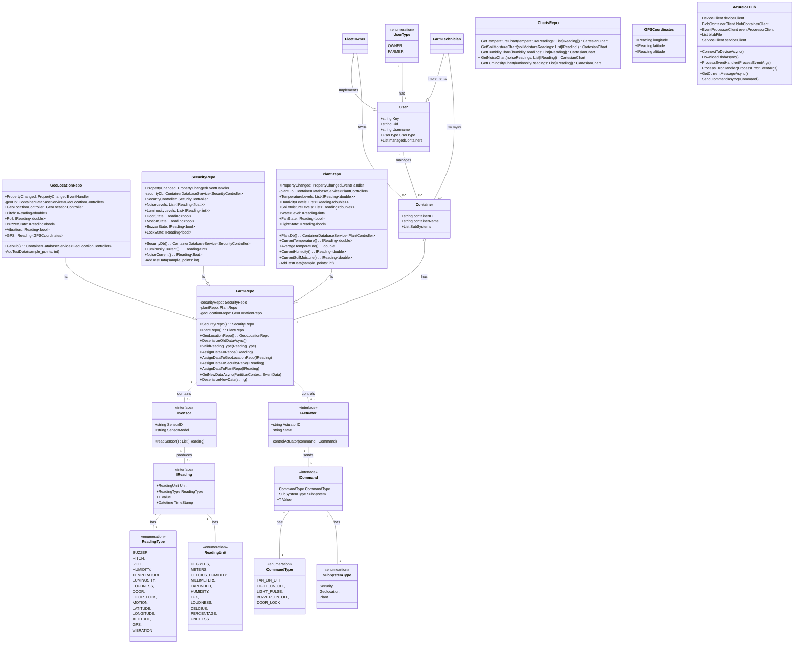

## 🚀 Team Information
- **Team Woody**
  - **Noah Groleau: 2028706**
  - **Diana Karpeev: 2059788**
  - **Katchenin Cindy Coulibaly: 2126537**


## 🌱 Woody - Smart Farming App
Introducing Woody, your ultimate solution for upgrading basic container greenhouses into smart farms.

With Woody, fleet owners can easily keep tabs on all their containers, worry-free about fleet security. Meanwhile, farm technicians can conveniently manage plants from outside the container, thanks to various monitoring sensors and controls that can adjust environmental conditions.

Our goal is to make it easier than ever to grow your crops in a smarter way!

Woody uses a seeed reTerminal to take sensor readings and control the container. The plant system includes a water level sensor, soil moisture sensor, RGB Led Stick, cooling fan and temperature and humidity sensor. The container always has geolocation so that you can easily track your container's location. This system includes a GPS and accelerometer. Besides geolocation, we also want the container to be secure, with a motion sensor, buzzer, door sensor, door lock and sound sensor you don't have to worry about security.

We wanted Woody to be practical which is why besides all the hardware we developed a .NET MAUI mobile app. The app allows you to create an account as a technician or fleet owner and view sensor readings and have access to control panels for your container.

[Design Document](https://docs.google.com/document/d/1MMz9QzN8PgNpPY9unR-ARdnCKaAS4ccCn0LuVVTUnHU/edit?usp=sharing)

[Team Contract](https://docs.google.com/document/d/1IBiwbEVRstDoR5DC-ZAtVx-RRKVjXoynYvoooI--fi4/edit?usp=sharing)

## 🤝 Contributions
|Team Member|Contributions|
|-----------|-------------|
| Diana| Plant Subsystem, UI Design and Polish|
| Noah | Security Subsystem, Azure Cloud Integration Python, Azure Portal Setup|
| Cindy | Geolocation Subsystem, Azure Cloud Integration C#, Firebase & Azure Portal Setup |

Diana created the scripts for all plant subsystem hardware and the controller. She also prepared the UI mockups and implemented them in our app, along with the UI polish. Cindy and I worked on the Azure Cloud Integration (researching and creating Azure resources), with Cindy focusing on the C# side and I on the Python side. Cindy also worked on the geolocation subsystem, and I worked on the security subsystem. Cindy also set up the Firebase and authentication for our project.

## 📈 Epics
- [Fleet Owner and Farm Technician Authentication and Views](https://github.com/JAC-Final-Project-W24-6A6-6P3/final-project-woody/issues/49)
- [Azure Cloud Integration](https://github.com/JAC-Final-Project-W24-6A6-6P3/final-project-woody/issues/28)
- [Security Monitoring of Container Farms for Fleet Owners](https://github.com/JAC-Final-Project-W24-6A6-6P3/final-project-woody/issues/7)
- [Tracking and Location of Container Farms for Fleet Owners](https://github.com/JAC-Final-Project-W24-6A6-6P3/final-project-woody/issues/6)
- [Control of Environmental Conditions for Farm Technicians](https://github.com/JAC-Final-Project-W24-6A6-6P3/final-project-woody/issues/5)
- [Real-Time Environmental Monitoring for Farm Technicians](https://github.com/JAC-Final-Project-W24-6A6-6P3/final-project-woody/issues/3)

## 📱 Mobile App
The Woody app revolutionizes traditional container farming by integrating smart technology to enhance efficiency and security. Designed for both fleet owners and farm technicians, this application leverages sensors and cloud integration to monitor and control environmental conditions within container greenhouses remotely. Key features include real-time notifications for critical events, role-based access for personalized user experiences, comprehensive container management tools, data visualization for trend analysis, and geolocation tracking for enhanced logistics. Developed using .NET MAUI, the app ensures ease of use and robust functionality.

### 🔑 Key Features

- **Real-time Notifications:** Receive timely notifications for events such as breached thresholds and security alerts, ensuring proactive management.
- **Role-based Access:** Role-specific views and functionalities cater to both farm technicians and fleet owners, ensuring tailored experiences.
- **Container Management:** Easily display and control container security and environmental conditions, providing comprehensive oversight.
- **Data Visualization:** Visualize data changes over time through interactive graphs, facilitating informed decision-making and trend analysis.
- **Geolocation Tracking:** Display container geolocation for fleet owners, enhancing fleet management and logistics planning.

### 👀 Sneakpeek

# TODO: ADD NEW SCREENSHOTS WITH CAPTIONS


 


*Color versions coming soon!*
### 📊 UML Diagram


## 🛠️ App Setup
### Setup
Create an Azure IoT Hub, Event Hub, and Storage Account. Create a Firebase project and set up Firebase Authentication and RealTime DB. Add the required configurations to the appsettings.json file.

### Configuration
Required configurations needed to run the app.
- Iot Hub
  - IOTHubDeviceConnectionString: Navigate to IoTHub -> Devices -> Select Device -> Primary Connection String
  - IOTHubDeviceId: Navigate to IoTHub -> Devices -> Select Device -> Device Name/ID
  - IOTHubConnectionString: Navigate to IoTHub -> Shared access policies -> iothubowner -> Primary Connection String
  - BlobContainerName: Navigate to Storage account -> Containers -> Desired container name
  - BlobConnectionString: Navigate to Storage account -> Access keys -> Connection string
  - EventHubConnectionString: Navigate to Event Hubs Namespace -> Shared access policies -> RootManageSharedAccessKey -> Primary Connection String
  - EventHubName: Navigate to Event Hubs Namespace -> Event Hubs -> Desired Event Hub name
  - EventHubConsumer: Navigate to Event Hubs Instance -> Consumer groups -> Desired Consumer group name
- Firebase
    - FirebaseAuthorizedDomain: Navigate to Firebase Console -> Project -> Settings -> Authorized Domains
    - FirebaseApikey: Navigate to Firebase Console -> Project -> Project Settings -> General -> Web API key
    - FirebaseDatabaseUrl: Navigate to Firebase Console -> Project -> Realtime Database -> Copy URL

### Test Login Credentials
- **Fleet Owner**
    - Email: ownerowner@owner.ca
    - Password: ownerowner
- **Farm Technician**
    - Email: farmer@test.ca
    - Password: farmer

## 🔮 Future Works
- Features
    - Save User Preferences
    - Creating Multiple Containers
    - Tasks
    - Geolocation 3D Visualization
- Bugs
    - [App Carousel Swiping](https://github.com/JAC-Final-Project-W24-6A6-6P3/final-project-woody/issues/133)
    - [IndicatorView delay](https://github.com/JAC-Final-Project-W24-6A6-6P3/final-project-woody/issues/137)
## 🌟 Bonus Features & Project Documentation
### IoT Hub Storage
- Storage Type: Blob Storage
- Reason: IoT Hub is a fully managed service that enables reliable and secure bidirectional communication between millions of IoT devices and a solution back end. It also provides a secure way to store data from IoT devices. Blob storage is a good choice for storing large amounts of unstructured data, such as text or binary data.
- Create an event in Storage Account 

## 💡 Controlling Actuators

### Buzzer Control

**Actuator:** Buzzer  
**Subsystem(s):** Geo/Security  
**Communication Strategy:** Direct Methods  
**Reason:** Uses Direct Methods since they are preferred when real-time interaction with the device is necessary, and an immediate response is required. This ensures that the action taken by the backend is confirmed by the device, enhancing reliability and control.

**Example command to turn buzzer on:**

```bash 
 az iot hub invoke-device-method --hub-name {iothub_name} --device-id {device_id} --method-name control_actuators --method-payload '{ "value": "on", "command-type": "buzzer-on-off", "subsystem-type": "security" }'
 ```

 **Example command to turn buzzer off:**

```bash 
 az iot hub invoke-device-method --hub-name {iothub_name} --device-id {device_id} --method-name control_actuators --method-payload '{ "value": "off", "command-type": "buzzer-on-off", "subsystem-type": "security" }'
 ```


### Fan Control

**Actuator:** Fan  
**Subsystem(s):** Plant  
**Communication Strategy:** Direct Methods  
**Reason:** Uses Direct Methods since they are preferred when real-time interaction with the device is necessary, and an immediate response is required. This ensures that the action taken by the backend is confirmed by the device, enhancing reliability and control.

**Example command to turn the fan on:**

```bash 
 az iot hub invoke-device-method --hub-name {iothub_name} --device-id {device_id} --method-name control_actuators --method-payload '{ "value": "on", "command-type": "fan-on-off", "subsystem-type": "plant" }'
 ```

**Example command to turn the fan off:**

```bash 
 az iot hub invoke-device-method --hub-name {iothub_name} --device-id {device_id} --method-name control_actuators --method-payload '{ "value": "off", "command-type": "fan-on-off", "subsystem-type": "plant" }'
 ```

### RGB LED Control

**Actuator:** RGB Led  
**Subsystem(s):** Plant  
**Communication Strategy:** Direct Methods  
**Reason:** Uses Direct Methods since they are preferred when real-time interaction with the device is necessary, and an immediate response is required. This ensures that the action taken by the backend is confirmed by the device, enhancing reliability and control.

**Example command to turn the RGB LED on:**
```bash 
az iot hub invoke-device-method --hub-name {iothub_name} --device-id {device_id} --method-name control_actuators --method-payload '{ "value": "on", "command-type": "light-on-off", "subsystem-type": "plant" }'
```

**Example command to turn the RGB LED off:**
```bash 
az iot hub invoke-device-method --hub-name {iothub_name} --device-id {device_id} --method-name control_actuators --method-payload '{ "value": "off", "command-type": "light-on-off", "subsystem-type": "plant" }'
```

### Door Lock Control

**Actuator:** Door Lock  
**Subsystem(s):** Security  
**Communication Strategy:** Direct Methods  
**Reason:** Uses Direct Methods since they are preferred when real-time interaction with the device is necessary, and an immediate response is required. This ensures that the action taken by the backend is confirmed by the device, enhancing reliability and control.

**Example command to control the door lock:**

```bash  
az iot hub invoke-device-method --hub-name {iothub_name} --device-id {device_id} --method-name control_actuators --method-payload '{ "value": "<string representation of integer between -1 and 1>", "command-type": "door-lock", "subsystem-type": "security" }'
```
 
## 🐱‍💻 Authors
Diana Karpeev <br>
Katchenin Cindy Coulibaly <br>
Noah Groleau
